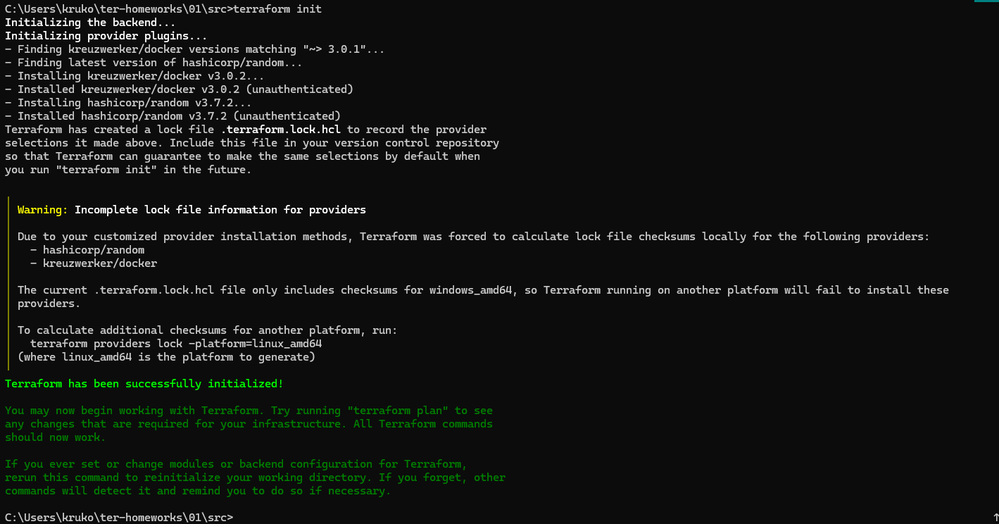
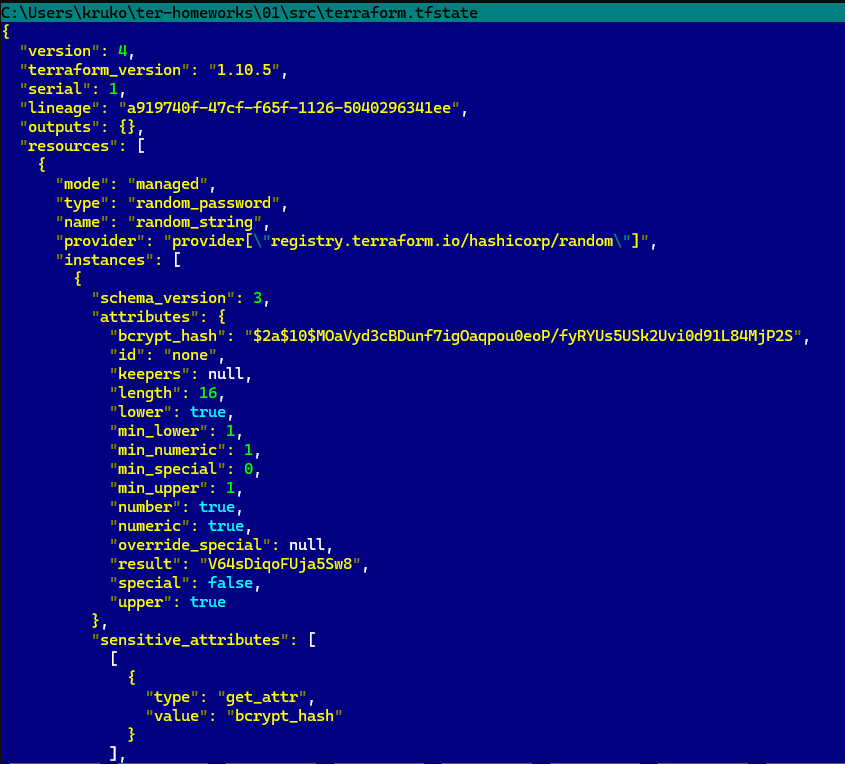
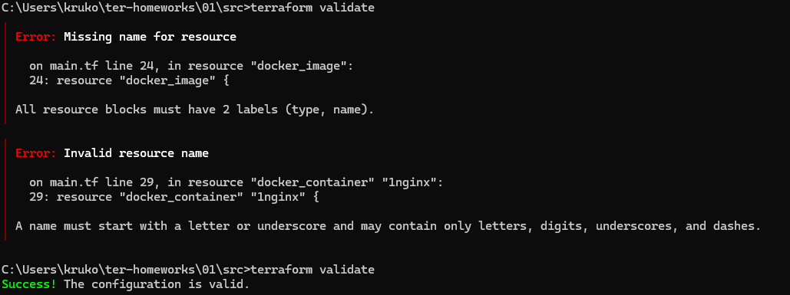
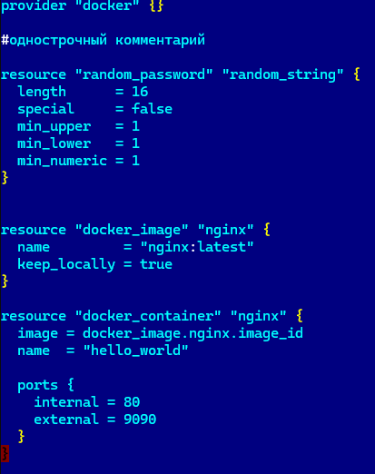
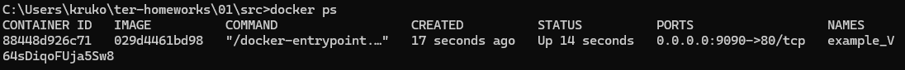
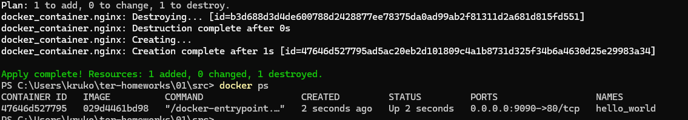
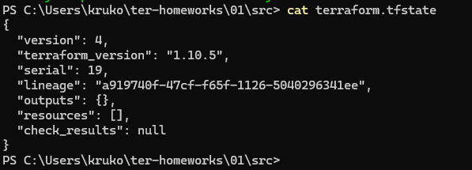
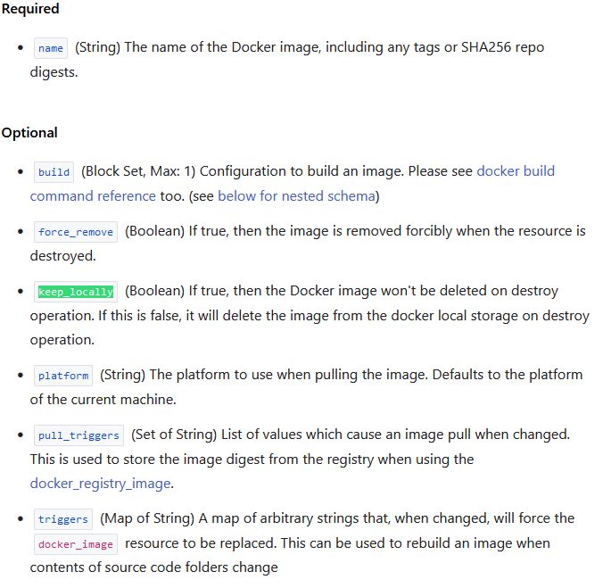

# Домашнее задание к занятию «Введение в Terraform»

### Цели задания

1. Установить и настроить Terrafrom.
2. Научиться использовать готовый код.

------

### Чек-лист готовности к домашнему заданию

1. Скачайте и установите **Terraform** версии >=1.8.4 . Приложите скриншот вывода команды ```terraform --version```.
2. Скачайте на свой ПК этот git-репозиторий. Исходный код для выполнения задания расположен в директории **01/src**.
3. Убедитесь, что в вашей ОС установлен docker.

------

### Инструменты и дополнительные материалы, которые пригодятся для выполнения задания

1. Репозиторий с ссылкой на зеркало для установки и настройки Terraform: [ссылка](https://github.com/netology-code/devops-materials).
2. Установка docker: [ссылка](https://docs.docker.com/engine/install/ubuntu/). 
------
### Внимание!! Обязательно предоставляем на проверку получившийся код в виде ссылки на ваш github-репозиторий!
------

### Задание 1

1. Перейдите в каталог [**src**](https://github.com/netology-code/ter-homeworks/tree/main/01/src). Скачайте все необходимые зависимости, использованные в проекте. 
2. Изучите файл **.gitignore**. В каком terraform-файле, согласно этому .gitignore, допустимо сохранить личную, секретную информацию?(логины,пароли,ключи,токены итд)
3. Выполните код проекта. Найдите  в state-файле секретное содержимое созданного ресурса **random_password**, пришлите в качестве ответа конкретный ключ и его значение.
4. Раскомментируйте блок кода, примерно расположенный на строчках 29–42 файла **main.tf**.
Выполните команду ```terraform validate```. Объясните, в чём заключаются намеренно допущенные ошибки. Исправьте их.
5. Выполните код. В качестве ответа приложите: исправленный фрагмент кода и вывод команды ```docker ps```.
6. Замените имя docker-контейнера в блоке кода на ```hello_world```. Не перепутайте имя контейнера и имя образа. Мы всё ещё продолжаем использовать name = "nginx:latest". Выполните команду ```terraform apply -auto-approve```.
Объясните своими словами, в чём может быть опасность применения ключа  ```-auto-approve```. Догадайтесь или нагуглите зачем может пригодиться данный ключ? В качестве ответа дополнительно приложите вывод команды ```docker ps```.
8. Уничтожьте созданные ресурсы с помощью **terraform**. Убедитесь, что все ресурсы удалены. Приложите содержимое файла **terraform.tfstate**. 
9. Объясните, почему при этом не был удалён docker-образ **nginx:latest**. Ответ **ОБЯЗАТЕЛЬНО НАЙДИТЕ В ПРЕДОСТАВЛЕННОМ КОДЕ**, а затем **ОБЯЗАТЕЛЬНО ПОДКРЕПИТЕ** строчкой из документации [**terraform провайдера docker**](https://docs.comcloud.xyz/providers/kreuzwerker/docker/latest/docs).  (ищите в классификаторе resource docker_image )


------

**Решение**


2. Результат запуска *terraform init* В файле *.gitignore* есть подсказка: *# own secret vars store*, там прописан файл для хранения переменных персональной авторизации- personal.auto.tfvars. Так же файлы *.tfstate и *.tfstate.* сохраняют состояние инфраструктуры и могут содержать конфиденциальные данные, такие как пароли и токены. Иногда следует добавлять файлы *.tfvars так как переменные так же могут содержать конфиденциальную информацию. Туда же можно добавлять файлы конфигурации CLI *.terraformrc*. Более полный список файлов можно найти в [официальной документации](https://github.com/github/gitignore/blob/main/Terraform.gitignore) Github.





3. Ключ в файле *terraform.tfstate*





4. После добавления в скрипт закомменченных строчек возникли две ошибки:



   В строке 24 ресурс описан не полностью, отсутсвует часть, относящаеся к имени ресурса.</br>
   В строке 29 имя ресурса начинается на цифру, что не допустимо.</br>
   Так же были ошибки в использовании ресурса *random_string* в строке 31.</br>
   В итоге [файл](main.tf) проходит валидацию.


   
5. Получаем список контейнеров *docker ps*
   


6.   Не составило труда изменить имя контейнера на *"hello_world"*



   Ключ -auto-approve в Terraform используется для автоматического подтверждения выполнения операций, таких как terraform apply и terraform destroy, без необходимости ручного вмешательства.
   Данный ключ может использоваться для автоматизации процессов развёртки, но опасен непредсказуемостью и необратимостью процессов в случае ошибки в коде.

7. Созданные ресурсы были удалены командой *terraform destroy*. Содержимое файла *terraform.tfstate*:



9. docker-образ **nginx:latest** не был удалён так как в конфигурации ресурса *resource "docker_image" "nginx"* была строчка *keep_locally = true*.




